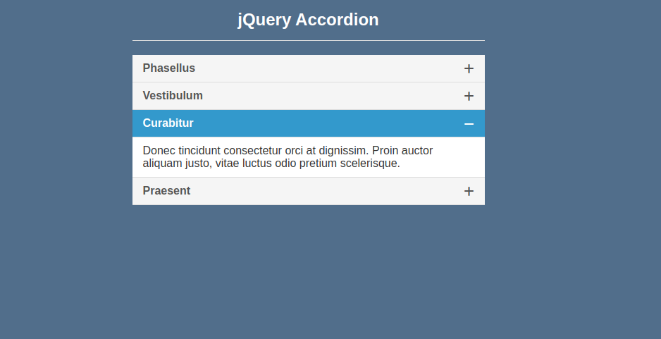

**Getting started:-**

We start off by creating a folder named **jQuery Accordion**. We open this folder in an editor. I am using Atom for it. Having done that, we will create a file named ‘index.html’ which will be storing the Html structure of our web page.

**Creating index.html file:-**

We give our web page the title **“jQuery Accordion”**. We include css in our project with the following code:-

`<link rel="stylesheet" href="css/style.css">`

and fontawesome from external cdn link

`<link href="https://cdnjs.cloudflare.com/ajax/libs/font-awesome/6.1.1/css/all.min.css" rel="stylesheet">`

We also include jQuery in our project with the following code:-

`<script src="js/jquery-3.6.0.js"></script>`

and we include custom jQuery code in our project with the following code:-

`<script src="js/custom.js"></script>`

**index.html file**

```html
<!DOCTYPE html>
<html>
    <head>
        <title>
            jQuery Accordion
        </title>
        <link href="https://cdnjs.cloudflare.com/ajax/libs/font-awesome/6.1.1/css/all.min.css" rel="stylesheet">
            <link href="css/style.css" rel="stylesheet">
            </link>
        </link>
    </head>
    <body>
        <div class="accordion-container">
            <h2>
                jQuery Accordion
            </h2>
            <div class="set">
                <a href="#">
                    Phasellus
                    <i class="fa fa-plus">
                    </i>
                </a>
                <div class="content">
                    <p>
                        Aliquam cursus vitae nulla non rhoncus. Nunc condimentum erat nec dictum tempus. Suspendisse aliquam erat hendrerit vehicula vestibulum.
                    </p>
                </div>
            </div>
            <div class="set">
                <a href="#">
                    Vestibulum
                    <i class="fa fa-plus">
                    </i>
                </a>
                <div class="content">
                    <p>
                        Lorem ipsum dolor sit amet, consectetur adipiscing elit, sed do eiusmod tempor incididunt ut labore et dolore magna.
                    </p>
                </div>
            </div>
            <div class="set">
                <a href="#">
                    Curabitur
                    <i class="fa fa-plus">
                    </i>
                </a>
                <div class="content">
                    <p>
                        Donec tincidunt consectetur orci at dignissim. Proin auctor aliquam justo, vitae luctus odio pretium scelerisque.
                    </p>
                </div>
            </div>
            <div class="set">
                <a href="#">
                    Praesent
                    <i class="fa fa-plus">
                    </i>
                </a>
                <div class="content">
                    <p>
                        Pellentesque aliquam ligula libero, vitae imperdiet diam porta vitae. sed do eiusmod tempor incididunt ut labore et dolore magna.
                    </p>
                </div>
            </div>
        </div>
        <script src="js/jquery-3.6.0.js">
        </script>
        <script src="js/custom.js">
        </script>
    </body>
</html>
```

**style.css file**

```css

body {
    background-color: #516e8b;
    padding: 0 10px;
    font-family: 'Open Sans', sans-serif;
}
.accordion-container {
    max-width: 500px;
    position: relative;
    margin: 10px auto;
    height: auto;
}
.accordion-container>h2 {
    color: #fff;
    text-align: center;
    margin-bottom: 20px;
    padding-bottom: 5px;
    border-bottom: 1px solid #ddd;
    padding-bottom: 15px;
}
.set {
    position: relative;
    height: auto;
    background-color: #f5f5f5;
    width: 100%;
}
.set>a {
    padding: 10px 15px;
    display: block;
    text-decoration: none;
    font-weight: 600;
    color: #555;
    border-bottom: 1px solid #ddd;
    transition: all 0.2s linear;
    -webkit-transition: all 0.2s linear;
    -moz-transition: all 0.2s linear;
}
.set>a i {
    margin-top: 2px;
    float: right;
}
.set>a.active {
    color: #fff;
    background-color: #3399cc;
}
.content {
    border-bottom: 1px solid #ddd;
    background-color: #fff;
    display: none;
}
.content p {
    padding: 10px 15px;
    color: #333;
    margin: 0;
}


```

**custom.js file:-**

```js
$(document).ready(function() {
    $(".set > a").on("click", function() {
        if ($(this).hasClass("active")) {
            $(this).removeClass("active");
            $(this).siblings(".content").slideUp(200);
            $(".set > a i").removeClass("fa-minus").addClass("fa-plus");
        } else {
            $(".set > a i").removeClass("fa-minus").addClass("fa-plus");
            $(this).find("i").removeClass("fa-plus").addClass("fa-minus");
            $(".set > a").removeClass("active");
            $(this).addClass("active");
            $(".content").slideUp(200);
            $(this).siblings(".content").slideDown(200);
        }
    });
});


```

# Output



***